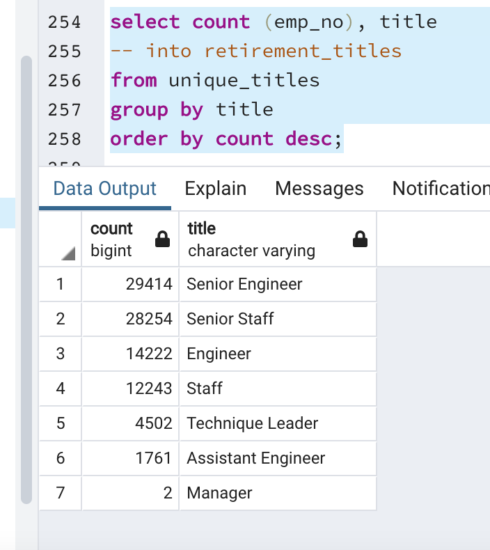
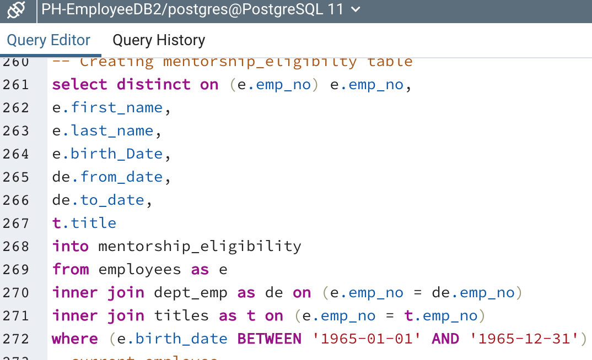
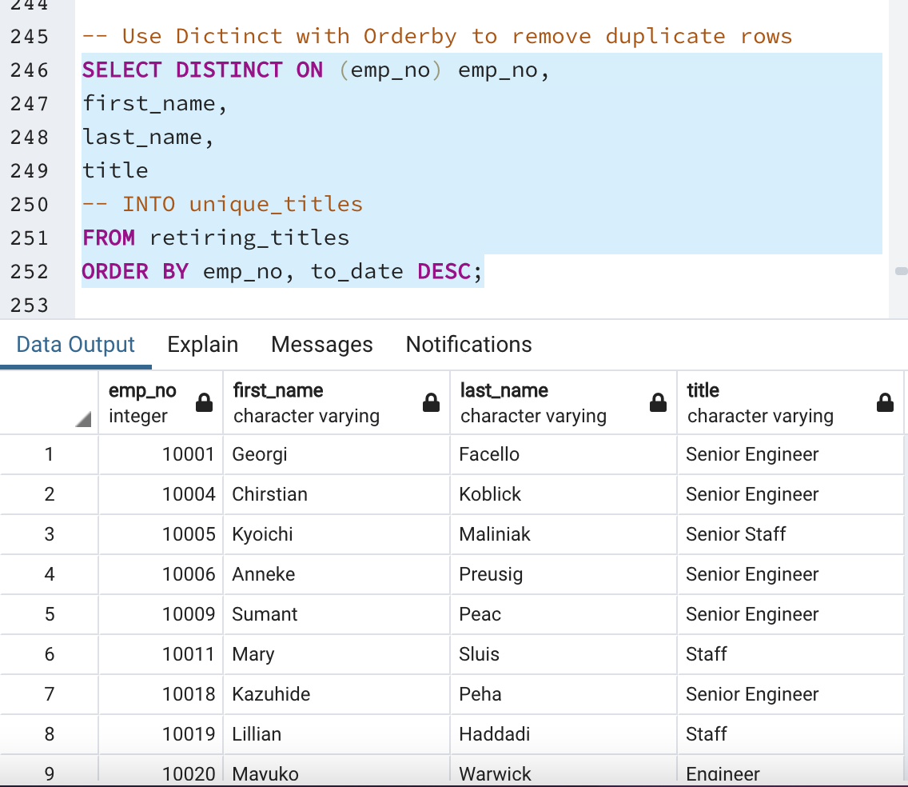
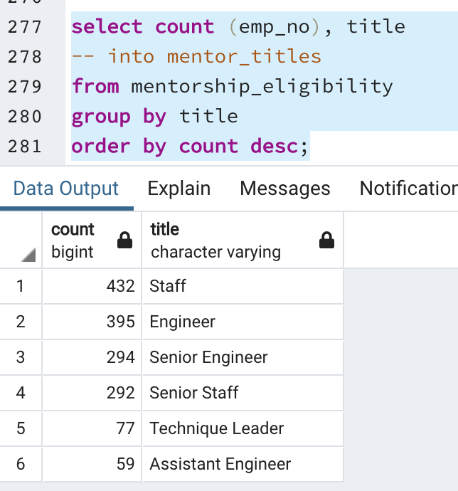

# Pewlett-Hackard-Analysis
## Overview
As many of Pewlett Hackard employees are set to retire soon, I have been tasked with analyzing employee data to gain a better understanding of the potential effects of this on their workforce. This analysis will help make long term decisions for the company. They are considering starting mentorship program where the employees set to retire soon mentor those behind them to prepare them to take over the roles they will be leaving vacant.  Prior to completing my analysis, Pewlett Hackard had 6 csv files and had predominantly used excel and VBA. I used SQL to analyze this data and create additional tables/csv files in order to draw conclusions about who is retiring at Pewlett Hackard, the positions they hold, and who could potentially fill these roles.  
## Results
- I used an inner join to join the titles and employees table to create the retiring_titles table. This table showcases every employee nearing the age of retirment, the titles they have held, and dates of employment. There are a total of 133,776 values in this table. 
- The 133,776 values is not the true number of employees retiring. Employees may have held multiple roles; in order to control for this I used the distinct on function to remove the duplicate values and created the unique_titles table. The Unique titles table gives a more accurate representation of the total number of employees retiring. 
- The retirement_titles table I created displays how many employees of each title are leaving. See below image for breakdown. 

- The mentorship_eligibility table shows who is eligible for the mentorship. In the code we can see that we filtered the birthdate to be about 10 years ealier than the years I filtered for retirement age. See below. 

## Summary 
### How many roles will need to be filled as the "silver tsunami" begins to make an impact?
As stated before, the 133,776 employees retiring in the retiring_titles contains duplicate values as it shows all the titles an employee has held. The unique_titles table controls for that and gives a total of 90,398.

### Are there enough qualified, retirement-ready employees in the departments to mentor the next generation of Pewlett Hackard employees?
In order to answer this question, we have to take a look at the mentor_eligibility table. Using the count function, I found that there are only 1549 employees eligible for this program. This number is much lower than the total number of empoyees retiring at the company. To see this breakdown by department I created a new table similar to retirement_titles to show the brekadown of those elgibile for mentorship by department. 

